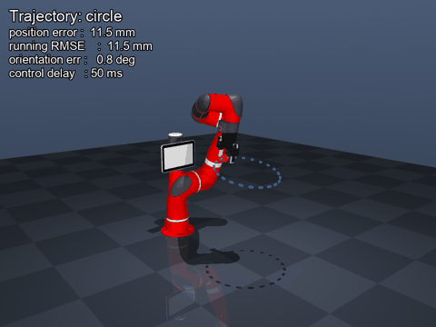

# RL End-Effector Trajectory Tracking

Teaching a **Sawyer** arm (Rethink Robotics) with a **Robotiq-85** gripper to
follow a moving 3-D Cartesian trajectory — accurately, smoothly, and robustly
to noise and control delay — using **residual reinforcement learning**.



> Sawyer + Robotiq-85 tracking a circle — blue ribbon = desired path,
> red sphere = current target, green trail = actual end-effector path.

### ▶ Full demo video — circle, figure-8 & moving target

<video src="https://github.com/EvaEkhteyary/rl-end-effector-tracking/raw/main/results/tracking_demo.mp4" controls muted width="720"></video>

If the embedded player does not load, view
[`results/tracking_demo.mp4`](results/tracking_demo.mp4) directly (it plays in
GitHub's file viewer).

---

## TL;DR — the idea

Instead of asking RL to learn a whole controller from scratch, the policy
learns only a **small bounded correction** on top of a classic model-based
controller:

```
joint command  =  resolved-rate base controller(trajectory)  +  RL residual(observation)
```

The base controller (damped-least-squares Jacobian inverse) does coarse
tracking. The **RL policy (PPO)** learns exactly the part a model-based
controller cannot: compensating control delay, dynamics lag, sensor noise and
near-singular / unreachable configurations.

This buys three things the challenge explicitly asks for:

* **Accuracy** — RL closes the tracking lag of the (filtered) base controller.
* **Smoothness** — a low-pass command filter plus a bounded residual make
  motion jitter-free *by construction*, reinforced by jerk penalties in the reward.
* **Robustness** — the policy is *trained on* randomised delay/noise, and the
  base controller is always a stable fallback.

Full reasoning in **[DESIGN.md](DESIGN.md)**.

---

## The idea in one sentence

A classical **Jacobian controller** handles the easy part. A trained **PPO policy** fixes the rest — noise, lag, near-singular positions.

```
final command = Jacobian base controller + RL residual correction
```

---
Full reasoning in **[DESIGN.md](DESIGN.md)**.


## Quickstart
1. create the virtual environment
```
make setup PYTHON=python3.12
```

2. activate it in your terminal (you'll see (.venv) appear in your prompt)

```
source ./.venv/bin/activate
```
3. run everything
train → evaluate → render (~15 min, 8-core CPU)
```
make all
```
or just regenerate plots and videos from te trained model
```    
make demo      
```

> Note: `source ./.venv/bin/activate` must be run once per terminal session.
> If you close and reopen the terminal, run it again before any commands.

The repo ships with a trained model (`models/`) and results (`results/`) already included, so `make demo` works immediately with no training needed.

### Manual commands (optional)

Once the environment is activated, you can run each step individually instead of using `make`:

```bash
python -m src.train       # train the policy
python -m src.evaluate    # run tests and produce charts
python -m src.render      # record demo video
python -m src.render --gui   # live interactive viewer
```

---

## Results

### Tracking accuracy (position RMSE)

| Trajectory       | Base only | + RL        | Improvement |
|------------------|----------:|------------:|------------:|
| Circle           | 24.8 mm   | **6.7 mm**  | **−73%**    |
| Figure-8         | 35.1 mm   | **8.4 mm**  | **−76%**    |
| Moving target    | 5.3 mm    | 6.2 mm      | —           |
| Unreachable      | 288.4 mm  | **51.8 mm** | **−82%**    |

Moving target: base controller already near-optimal, RL has nothing to add.
Unreachable: base controller flails at joint limits. RL degrades gracefully.

### Robustness to control delay (figure-8 RMSE, mm)

| Delay        | 0 ms | 50 ms | 100 ms | 150 ms | 200 ms |
|--------------|-----:|------:|-------:|-------:|-------:|
| Base only    | 29.7 | 35.1  | 41.2   | 49.6   | 66.6   |
| + RL         | 7.6  | 8.4   | 11.4   | 17.7   | 30.8   |

At 200 ms lag, RL still beats the base controller at zero lag. Trained with **domain randomisation** (0–150 ms delay per episode) so it anticipates rather than reacts.

---

## Design

| | |
|---|---|
| **State (70-D)** | joint angles + velocities, EE pose error, 5-step **trajectory preview**, base controller command, previous action |
| **Action (7-D)** | residual joint velocity, capped ±0.6 rad/s, **low-pass filtered** before reaching motors |
| **Reward** | Gaussian tracking kernels + sub-cm precision bonus − jerk penalty − action-rate penalty |
| **Uncertainty** | observation noise, action noise, **control delay 0–150 ms**, unreachable targets, all randomised per episode |

---

## Files

| File | Role |
|------|------|
| `src/arm_env.py` | **Gymnasium** environment — simulation, reward, uncertainty injection |
| `src/train.py` | **PPO** (Proximal policy optimization) training via Stable-Baselines3 |
| `src/base_controller.py` | Damped least-squares **Jacobian** controller |
| `src/trajectories.py` | Analytic circle / figure-8 / random paths (exact feed-forward velocity) |
| `src/evaluate.py` | Metrics + plots — base vs RL ablation |
| `src/render.py` | video: MP4 / GIF recording |
| `src/config.py` | All hyperparameters in one dataclass |
| `assets/sawyer.xml` | Self-contained Sawyer + Robotiq-85 model — no downloads |

Full design rationale in [DESIGN.md](DESIGN.md).
